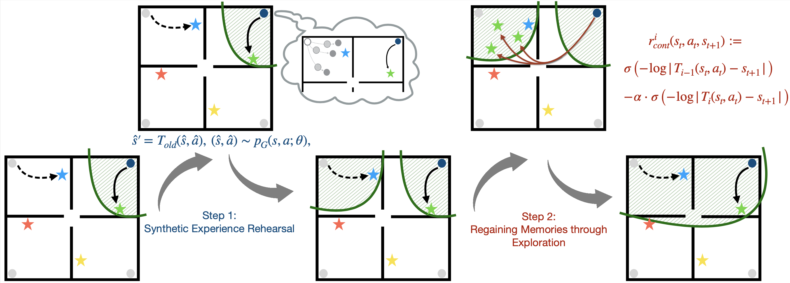

# Dynamics Learning while Retaining Memories

----

Original PyTorch implementation of **DRAGO** used on TD-MPC


<p align="center">
  <br><br>
   <a href="">[Paper]</a>
</p>


## Method

**DRAGO** is a framework for knowledge retention in continuel model-based reinforcement 
learning. By generating previously seen transitions and tracing back to previously familiar
states, DRAGO is able to enhance knowledge retention for dynamic models in MBRL algorithms,
resulting in a more general world model that improves knowledge transfer in learning
new tasks.


## Instructions

Assuming that you already have [MuJoCo](http://www.mujoco.org) installed, install dependencies using `conda`:

```
conda env create -f environment.yaml
conda activate drago
```

After installing dependencies, you can continually learn a comprehensive world model and corresponding
TD-MPC models of a sequence of tasks. 
For MiniGrid World, the continual learning tasks are based on MiniGrid-FourRooms. Every continual learning task initializes the agent at each corner respectively, with a goal set in the same room.
For cheetah, the continual learning tasks are: [cheetah-run, cheetah-jump, cheetah-run-backwards]): 
For walker, the continual learning tasks are: [walker-run, walker-run, walker-stand, walker-run-backwards]): 

```
python src/train.py env=minigrid domain=minigrid # add render_mode='human' for visualization
python src/train.py env=dmcontrol domain=cheetah
python src/train.py env=dmcontrol domain=walker
```

To load pretrained world model and train on a new task in the same domain,
for MiniGrid World, run:

```
python src/train.py env=minigrid domain=minigrid ckpt=PATH_TO_PRETRAINED_MODEL_FILE tasks=[MiniGrid-FourRooms-New] agent_poses=[[11,8]] goal_poses=[[14,9]] # you can modify agent initial position and goal position as needed
```

If you want to load pretrained world model and train for cheetah jump2run for evaluation:

```
python src/train.py env=dmcontrol domain=cheetah ckpt=PATH_TO_PRETRAINED_MODEL_FILE pre_rollout_ckpt=PATH_TO_PRETRAINED_CHEETAH_JUMP_MODEL tasks=[cheetah-run]
```

You can modify domain, pre-rollout model checkpoint, and tasks arguments to train for the transition between any two tasks included in continual learning for cheetah or walker.

In addition, you can load the pretrained world model and train for cheetah jump-and-run or cheetah jump-and-back as follows (jump-and-run as example):

```
python src/train.py env=dmcontrol domain=cheetah ckpt=PATH_TO_PRETRAINED_MODEL_FILE tasks=[cheetah-jump-and-run]
```


Evaluation videos and model weights can be saved with arguments `save_video=True` and `save_model=True`. Refer to the `cfgs` directory for a full list of options and default hyperparameters, and see `tasks.txt` for a list of supported tasks. We also provide results for all 23 state-based DMControl tasks in the `results` directory.

The training script supports both local logging as well as cloud-based logging with [Weights & Biases](https://wandb.ai). To use W&B, provide a key by setting the environment variable `WANDB_API_KEY=<YOUR_KEY>` and add your W&B project and entity details to `cfgs/default.yaml`.
